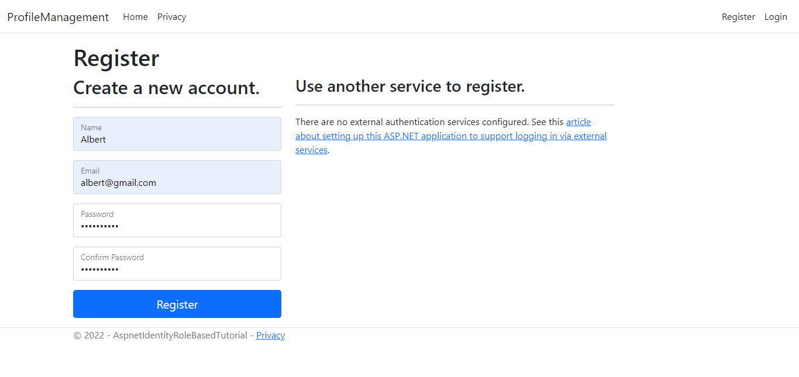

# Profile Management System
### Software Requirements
* Microsoft Visual Studio 2022
* Microsoft SQL Server Management Studio
### How to Run 
Download the project as a ziped folder and extract that then open the project in visual studio and press run button.
### Modules
* Register
* Login
* Manage Account
* Profile
### Outputs
#### 1. Register Page

#### 2. Login Page

#### 3. Profile Page

#### 4. Admin Login Page   
Email id : admin@gmail.com  
Password : Admin@123

